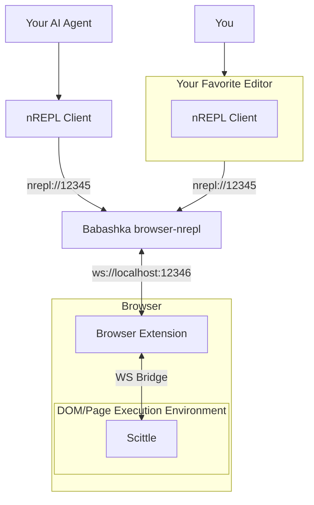

# Browser Jack-in

A web browser extension that lets you inject a [Scittle](https://github.com/babashka/scittle) REPL server into the browser page. Then you can connect your favorite Clojure editor and inspect and manipulate the DOM to your heart's content. Or let your AI agent loose on the page.

## Prerequisite

1. [Babashka](https://babashka.org)
2. A REPL client (such as a Clojure editor, like [Calva](https://calva.io))

## Usage

Assuming you have [installed the extension](#installing).

On the web page where you want to jack-in your REPL client: open the **Browser Jack-in** extension
and follow the 1-2-3 step instructions.

Step **1** let's you copy a Babashka command line that starts the browser-nrepl server, which is sort of a relay between your editor and the browser page.

> [!NOTE]
> The extension does not tamper with the web pages until you connect the REPL. Once that is done the you evaluate code in the page context. It's similar to using the console in the development tools, but you do it from your editor, and instead of JavaScript you use ClojureScript.

## Demo

* https://www.youtube.com/watch?v=aJ06tdIjdy0

## How it Works

The Babashka server bridges nREPL (port 12345) to WebSocket (port 12346). The extension's content script runs in the browser's ISOLATED world, exempt from page CSP restrictions, and connects to localhost. It relays messages via `postMessage` to the MAIN world where Scittle evaluates code with full access to the page's DOM and JavaScript environment.

This architecture lets you REPL into sites with strict Content Security Policies (like GitHub) that would otherwise block WebSocket connections.

## Installing

Available on the Chrome Web Store: https://chromewebstore.google.com/detail/bfcbpnmgefiblppimmoncoflmcejdbei

Firefox pending review, but you can install the package manually in the browser's developer mode. Grab the extension zip file(s) from the latest [release](https://github.com/PEZ/browser-jack-in/releases).

**Firefox:**

1. Go to `about:debugging#/runtime/this-firefox`
2. Click "Load Temporary Add-on"
3. Select any file in `browser-jack-in-firefox.zip` file

**Chrome:**

0. Unpack `browser-jack-in-chrome.zip` (will unpack a `chrome` folder)
1. Go to `chrome://extensions`
2. Enable "Developer mode"
3. Click "Load unpacked"
4. Select the `chrome` folder

**Safari:**

I think I may skip publishing to the Safari App Store, because I value my sanity. (And actually the extension yet fails to establish the websocket connection in Safari. It tries to open it as a secure socket. If you know how to fix it, please file a PR.)

1. Safari → Settings → Developer → Click "Add Temporary Extension"
2. Select the `browser-jack-in-safari.zip` file
3. Ensure the extension is enabled in Safari → Settings → Extensions

## Privacy

The extension does not collect any data whatsoever, and never will.

## Licence

[MIT](LICENSE)

## Development

To build and hack on the extension, see the [development docs](docs/dev.md).

## Enjoy! ♥️

Please consider [sponsoring my open source work](https://github.com/sponsors/PEZ).

