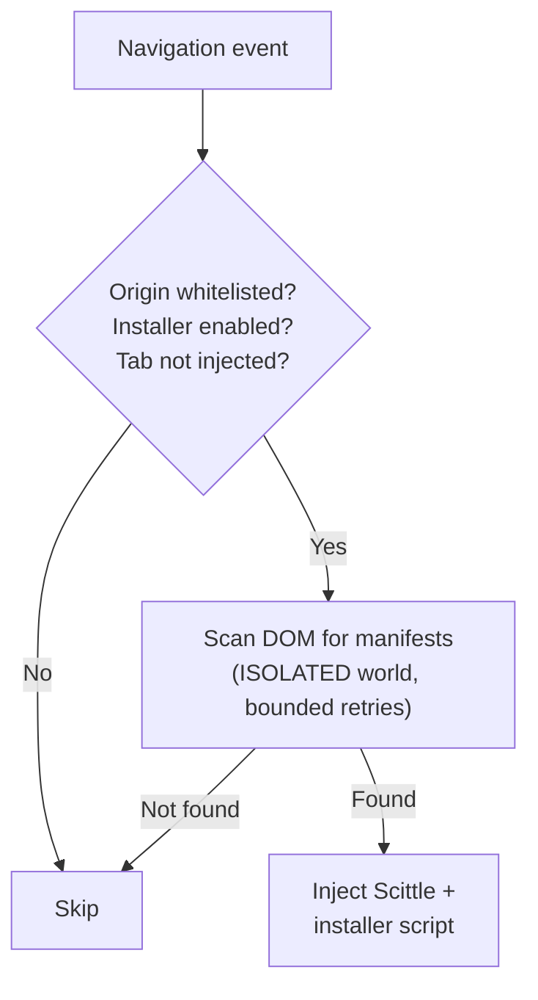
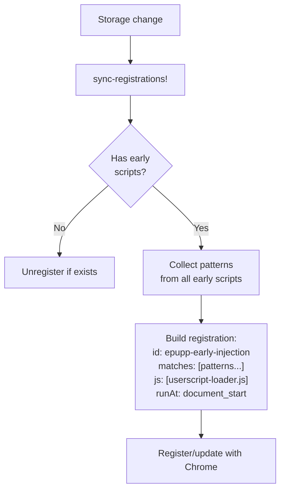
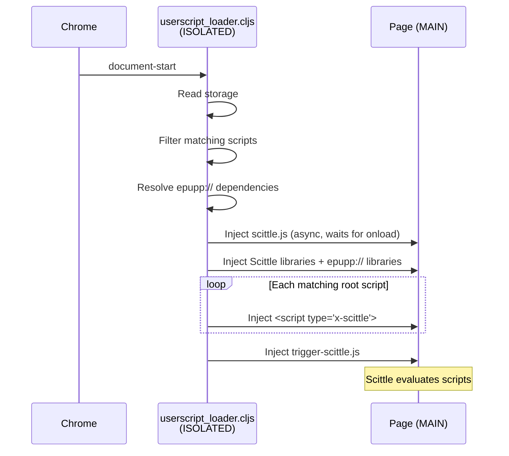

# Epupp Injection Flows

This document describes how code gets injected and evaluated across the three main workflows.

## Injection Flows

### REPL Connection (from Popup)

See [connected-repl.md](connected-repl.md) for full details including message flow diagrams.

1. User clicks "Connect" in popup
2. Popup sends `connect-tab` message to background worker with `tabId` and `wsPort`
3. Background's `connect-tab!` orchestrates the connection:
   - Execute `check-status-fn` in page context
   - If no bridge: inject `content-bridge.js` (ISOLATED world)
   - Inject `ws-bridge.js` (MAIN world) if needed
   - Wait for bridge ready (ping/pong)
   - Ensure Scittle is loaded
    - Set `SCITTLE_NREPL_WEBSOCKET_PORT` global
    - Inject `vendor/scittle.nrepl.js` or reconnect existing client
    - Poll until WebSocket reaches OPEN state
    - **Inject Epupp API files** (`bundled/epupp/*.cljs` - provides `epupp.repl/manifest!`, `epupp.fs/*`, and `epupp.tools/*`)
4. `ws-bridge` intercepts WebSocket for `/_nrepl` URLs
5. Messages flow: Page ↔ Content Bridge ↔ Background ↔ Babashka relay

### Userscript Auto-Injection (on Navigation)

1. `webNavigation.onCompleted` fires (main frame only)
2. The listener dispatches `:nav/ax.handle-navigation` with `tabId` and URL
3. `:nav/ax.handle-navigation` clears tab runtime state, refreshes icon/status, and gathers auto-connect context
4. `:nav/ax.decide-connection` optionally reconnects, then queues `process-navigation!`
5. `process-navigation!` gets matching enabled scripts
6. Filters to `document-idle` scripts only
7. Resolve dependencies via `dep_resolver` (handles mixed `scittle://` + `epupp://` + HTTPS ext-dep graphs, topological ordering, dedup, cycle detection)
8. `ensure-scittle!` → `execute-plan!`
9. `execute-plan!` flow:
   - Inject content bridge
   - Wait for bridge ready (ping/pong)
   - Send `clear-userscripts` message
   - Inject required Scittle libraries (in dependency order)
   - Inject `epupp://` library scripts (in dependency order)
    - Inject HTTPS external dependency scripts from cache (in dependency order)
   - Send `inject-userscript` for each root script
    - Call `execute-in-page` with `trigger-scittle-fn`
10. Surface any resolution errors (missing libraries, cycles) in console, system banner, and per-script warning indicator

### Panel Evaluation (from DevTools)

1. User enters code, presses Ctrl+Enter
2. `:editor/ax.eval` action dispatched
3. Check `:panel/scittle-status`:
    - If `:loaded`: panel still sends `inject-libs` first when `:epupp/inject` is present
    - Otherwise: panel sends `inject-libs`, then follows with `ensure-scittle` and eval
4. Background resolves the inject vector as a synthetic deps-only plan
5. Background ensures Scittle for the tab, then runs `execute-plan!`
6. `eval-in-page!` uses `chrome.devtools.inspectedWindow.eval`
7. Wrapper calls `scittle.core.eval_string(code)`
8. Result returned via `:editor/ax.handle-eval-result`

### Popup Quick Run ("Run" button)

1. User clicks Run on a script in the popup
2. Popup sends `evaluate-script` to background with `tabId` and script code
3. Background resolves the script's inject vector through `dep_resolver`
4. Background ensures Scittle is loaded, runs `execute-plan!`, and executes the script via userscript tag injection

### Conditional Web Installer Injection (on Navigation)

The web installer detects userscript manifests on code hosting pages and adds install buttons. It uses conditional injection: a lightweight DOM scan determines whether to load Scittle, avoiding unnecessary overhead on pages without manifests.

See [web-installer.md](web-installer.md) for the full architecture, including the background scanning pipeline, page-side detection, format specs, SPA navigation support, and security model.

**Timing mystery**: The end-to-end time from navigation to visible install buttons varies significantly between builds in ways that don't correlate with code changes. The page-side installer itself is consistently fast (5-35ms from init to buttons), yet user-perceived delay can range from near-instant to over a second. The injection pipeline (Scittle loading, bridge setup, library injection, namespace verification) is the likely variable, but the exact cause of the inconsistency is not yet understood.



## External Dependency Resolution

External dependencies use a cache-centered model. Save-time flows prefetch and persist uncached URLs, manual eval-time flows are cache-first and fetch on miss, and auto-run/page-load injection still executes from cache only.

### Path 1: Resolve on Save

When a script is saved (via panel or FS API) and its `:epupp/inject` contains supported HTTPS external dependency URLs:

1. `:ext-dep/ax.resolve-uncached-urls` extracts external dependency URLs from the manifest set
2. URLs not already in cache are passed to `:ext-dep/fx.fetch-deps`
3. The effect fetches raw content directly from trusted GitHub content hosts
4. Fetched content is parsed for transitive `:epupp/inject` dependencies (recursive)
5. `:ext-dep/ax.cache-results` merges results into `extDepCache` in `chrome.storage.local`

Cache entries are keyed by the original HTTPS URL and contain:

```clojure
{:cache/code "..."              ; fetched source code
 :cache/url "https://..."       ; original pinned URL
 :cache/inject [...]            ; transitive deps from manifest
 :cache/fetched-at 1234567890   ; timestamp
 :cache/schema-version 1}
```

### Path 2: Manual Eval-Time Fetch on Miss

Manual dependency-loading entry points such as panel `inject-libs` and REPL `manifest!` first resolve against the current cache view.

1. If every needed supported HTTPS dependency is already cached, dependency resolution continues immediately with no network work.
2. If some supported HTTPS dependencies are missing, only those missing URLs are passed to `:ext-dep/fx.fetch-deps`.
3. Fetched results are persisted before dependency resolution resumes.
4. Resolution and injection continue only after the fetch/persist stage succeeds.
5. If the fetch or follow-up resolution fails, the eval-time flow returns an error instead of partially executing the consumer script.

### Path 3: Inject from Cache

At page load, the dependency resolver treats supported HTTPS URLs as `:ext-dep` kind. It looks up cached content and produces `:ext-dep-script` steps in the execution plan. If a URL is not in cache, a `:ext-dep/cache-miss` error is surfaced.

`extDepCache` persistence is isolated from the general storage persistence path. Script saves still trigger uncached external dependency resolution, but cache writes are persisted through a dedicated cache-only effect so general script persistence cannot overwrite fresher external dependency entries. Background startup hydrates the runtime cache view from persisted storage, storage-change handling updates that runtime state before re-resolution runs, and eval effects receive the cache they should use explicitly. That keeps save-time fetch, runtime re-resolution, and actual execution on the same cache view.

### Error Types

| Error | Cause |
|-------|-------|
| `:ext-dep/cache-miss` | A cache-only path needed an external dependency that was not cached yet |
| `:ext-dep/fetch-failed` | Network error fetching raw content |
| `:ext-dep/cycle` | Circular dependency chain detected |

### Constraints (v1)

- Public GitHub content only (no authentication)
- SHA pinning required (no branch/tag references)
- No cache eviction (SHA-pinned content is immutable)
- Supported hosts are `raw.githubusercontent.com` and `gist.githubusercontent.com`

## Content Script Registration

Scripts with early timing (`document-start` or `document-end`) use a different injection path than the default `document-idle` scripts. Both timings currently share the registered early loader at `document_start`; scripts that need DOM-ready semantics must wait explicitly.

### Injection Timing Options

| Value | Description | Injection Path |
|-------|-------------|----------------|
| `document-start` | Before page scripts run | `registerContentScripts` + loader |
| `document-end` | Also routed through the early loader at `document_start`; wait explicitly if DOM-ready semantics are needed | `registerContentScripts` + loader |
| `document-idle` | After page load (default) | `webNavigation.onCompleted` |

Scripts specify timing via the `:epupp/run-at` annotation in code, parsed by `manifest_parser.cljs`.

### Registration Architecture

Early scripts use a browser-specific registration API:

- Chrome: `chrome.scripting.registerContentScripts` (persistent)
- Firefox: `browser.contentScripts.register` (non-persistent, re-register on startup)



**Key design decisions:**
- Single registration ID (`epupp-early-injection`) covers all early scripts
- Registration fires the loader for union of all match patterns
- Loader filters to scripts matching current URL at runtime
- `persistAcrossSessions: true` survives browser restarts

### Userscript Loader Flow

The loader (`src/userscript_loader.cljs`, compiled through Squint to `extension/userscript_loader.mjs` then bundled to `build/userscript-loader.js`) runs in ISOLATED world at document-start:

1. Guard against multiple injections (`window.__epuppLoaderInjected`)
2. Read all scripts from `chrome.storage.local`
3. Filter to enabled scripts with early timing matching current URL
4. Resolve `epupp://` and HTTPS external library dependencies (transitive, with dedup and cycle detection)
5. Inject `vendor/scittle.js` asynchronously (waits for `onload` before proceeding)
6. Inject required Scittle libraries, then `epupp://` library scripts and cached external dependency scripts in dependency order
7. Inject each matching root script as `<script type="application/x-scittle">`
8. Inject `trigger-scittle.js` to evaluate all Scittle scripts

Note: Registration uses `document_start` for both `document-start` and
`document-end` scripts. The loader does not delay `document-end` scripts.
If a script needs DOM-ready semantics, it should handle that in code.



### Dual Injection Path Summary

| Timing | Trigger | Registration | Loader | Notes |
|--------|---------|--------------|--------|------|
| `document-idle` | `webNavigation.onCompleted` | No | No | Background orchestrates via content bridge |
| `document-start` | Chrome content script | Yes | Yes | Runs before page scripts |
| `document-end` | Chrome content script | Yes | Yes | Also routed via `document_start`; wait explicitly for DOM-ready if needed |

Early scripts bypass the background worker's injection orchestration entirely - the loader handles everything.
