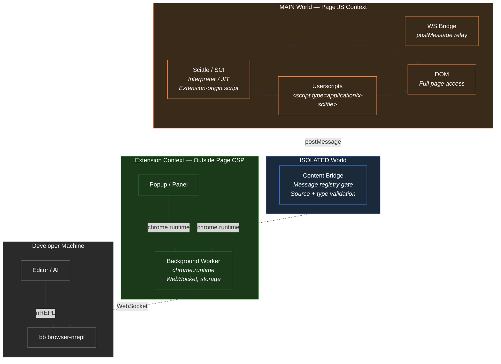

# Epupp Security Model

## Trust Boundaries and Execution Contexts



**Key boundaries:**
- **Orange** (MAIN world) - the page's JS context. Scittle, userscripts, and the WS bridge all run here with full DOM access. Page CSP still governs eval/Function in MAIN world; extension-origin lets Scittle *load* despite strict `script-src`.
- **Blue** (ISOLATED world) - the content bridge sits between page and extension. Has `chrome.runtime` access but no DOM. Validates every message against the registry before forwarding.
- **Green** (Extension context) - completely outside page CSP. The background worker holds the actual WebSocket to localhost and manages storage.
- **Grey** (Developer machine) - the nREPL relay and editor, connected via the background worker's WebSocket.

## How Epupp Runs Code in Pages Despite CSP

A natural first question: how does Epupp evaluate arbitrary code in the page context when sites like GitHub and YouTube have strict Content Security Policies? The answer has several layers.

### SCI: interpreter with optional JIT

[Scittle](https://github.com/babashka/scittle) embeds SCI (Small Clojure Interpreter). SCI primarily walks the ClojureScript AST as an interpreter. Recent SCI versions (Epupp ships 0.15.56 via Scittle 0.8.32) can also JIT-compile function bodies via `new Function()` by default. When `eval`/`Function` are unavailable - for example when CSP blocks them in a given execution context - SCI falls back to the interpreter.

### Extension-origin scripts can load despite page CSP

Scittle's JS files are loaded as `<script src="chrome-extension://EXTENSION_ID/vendor/scittle.js">` tags, listed in `web_accessible_resources` in the manifest. The browser treats these as extension-origin code, not page-origin code. That lets the browser fetch and run the Scittle library even when page `script-src` would block page-origin or third-party script tags (e.g. GitHub's `script-src github.githubassets.com`).

That loading exemption does not carry over to MAIN-world evaluation. Scittle and userscripts run in the page's MAIN world context. When page CSP blocks `eval` and `new Function()` - as on GitHub and YouTube - SCI cannot JIT and falls back to the interpreter. Epupp still works; you only get JIT speedup on pages that allow Function/eval.

Measured: a tight SCI loop runs ~1ms on unrestricted pages (e.g. blog.agical.se) where JIT is active, and ~20ms on CSP-strict pages (GitHub, YouTube) where SCI uses the interpreter.

### Userscript code uses non-executable script types

Userscript ClojureScript source is injected as `<script type="application/x-scittle">` inline tags. The browser ignores unknown script types entirely - no CSP inline-script violation. SCI reads those tags' `textContent` and interprets them.

### WebSocket connections relay through the background

CSP can block WebSocket connections to `localhost` from page context. Epupp's architecture avoids this: the background service worker holds the actual WebSocket to the `bb browser-nrepl` relay. Messages relay through the content bridge via `postMessage`. The extension's service worker context is completely outside page CSP.

```
Page (MAIN world) ──postMessage──> Content Bridge (ISOLATED) ──chrome.runtime──> Background Worker
                                                                                        │
                                                                                  WebSocket to
                                                                                  localhost:PORT
```

### Trusted Types

Some sites (YouTube, GitHub) enforce Trusted Types, which block raw string assignment to `.innerHTML`, `.src`, and similar sinks. Epupp creates a passthrough `default` Trusted Types policy before Scittle runs, in both [trigger-scittle.js](../../../extension/trigger-scittle.js) and the injection functions in [bg_inject.cljs](../../../src/bg_inject.cljs). This allows Scittle and Replicant to manipulate the DOM without Trusted Types violations.

### Summary

| CSP restriction | How Epupp handles it |
|-----------------|---------------------|
| `script-src` blocks inline scripts | Userscript code uses `application/x-scittle` type (not executed by browser) |
| `script-src` blocks `eval()` | SCI JIT uses `new Function()` when page CSP allows it (~1ms loops); falls back to interpreter when blocked (~20ms on GitHub/YouTube). Loading Scittle via `chrome-extension://` bypasses page `script-src` for script tags only - not eval/Function |
| CSP blocks WebSocket to localhost | Background worker holds the WebSocket (extension context, outside page CSP) |
| Trusted Types | Passthrough `default` policy created before Scittle runs |

NB: This works on both Chrome and Firefox without browser-specific APIs like the Chrome User Script API. Userscript injection via non-executable script types plus SCI evaluation avoid the browser executing inline page scripts. SCI JITs when page CSP allows `Function`/eval (unrestricted pages); on CSP-strict sites it interprets instead.

## Message Origin Isolation

The extension uses Chrome's built-in isolation between execution contexts:

| Context | Can call `chrome.runtime.sendMessage`? | Examples |
|---------|---------------------------------------|----------|
| Extension pages | Yes | popup.html, panel.html |
| Content scripts (ISOLATED world) | Yes | content_bridge.js |
| Page scripts (MAIN world) | **No** | userscripts, ws_bridge.js |

Page scripts (including userscripts) **cannot** directly send messages to the background worker. They can only communicate via `window.postMessage` to the content bridge, which explicitly whitelists what to forward.

## Content Bridge as Security Boundary

The content bridge ([content_bridge.cljs](../../../src/content_bridge.cljs)) is the sole gateway from page context to background. It uses a declarative message registry that controls which messages are forwarded. Every registered message declares its allowed sources and auth model. Unregistered types are silently dropped.

Key message categories:

| Auth Model | Messages | Purpose |
|------------|----------|---------|
| `:auth/none` | `ws-connect`, `load-manifest`, `check-script-exists`, `get-sponsored-username`, `capture-element`, `storage-get`, `storage-set`, `storage-remove`, `storage-keys`, `storage-clear` | Open access (read-only or low-risk) |
| `:auth/connected` | `ws-send` | Requires active REPL connection |
| `:auth/fs-sync+ws` | `list-scripts`, `get-script`, `save-script`, `rename-script`, `delete-script` | Requires FS REPL Sync enabled for the requesting tab AND active WebSocket connection |
| `:auth/domain-whitelist` | `web-installer-save-script` | Domain-gated save for web installer |
| `:auth/challenge-response` | `sponsor-status` | Background-initiated pre-authorization |

The registry in `content_bridge.cljs` is the authoritative whitelist - see it for the complete, always-current list.

**Domain whitelist for web installer**: The `web-installer-save-script` message only succeeds from whitelisted domains (github.com, gist.github.com, gitlab.com, codeberg.org, localhost, 127.0.0.1). Non-whitelisted domains trigger a copy-paste fallback in the installer UI.

When adding new forwarded message types, consider: "What if any page script could call this?" If the answer involves privilege escalation, don't forward it.

Any page script that can `postMessage` with `source: "epupp-page"` can call user storage (`storage-*` messages). The sandbox is the `epuppUserKv` blob in `chrome.storage.local`; it does not touch `scripts` or extension settings. Contrast with `epupp.fs`, which requires `:auth/fs-sync+ws` and can read or modify the userscript catalog.

## Host Permissions (Firefox)

Firefox treats `host_permissions` as optional and revocable, unlike Chrome where they are granted at install. Epupp checks host permission before every `chrome.scripting.executeScript` call:

- **`permissions.cljs`** - `check-tab-permission` resolves the tab URL and checks `chrome.permissions.contains`. Internal URLs (`chrome://`, `moz-extension://`, etc.) are assumed permitted.
- **`bg_inject.cljs`** - `execute-in-page`, `execute-in-isolated`, and `inject-content-script` all check permission before proceeding, throwing if missing.
- **`background.cljs`** - `process-navigation!` and `maybe-inject-installer!` check permission early and skip the tab silently if not granted.
- **`popup.cljs`** - checks `<all_urls>` permission on init and shows a warning banner with a "Grant Permission" button when missing.

On Chrome, the permission check always returns `true` (granted at install), so the overhead is negligible.

## Injection Guards

Scripts guard against multiple injections using global window flags:

| Module | Flag | Purpose |
|--------|------|---------|
| `content_bridge.cljs` | `window.__browserJackInContentBridge` | Prevent duplicate content bridge |
| `ws_bridge.cljs` | `window.__browserJackInWSBridge` | Prevent duplicate WS bridge |
